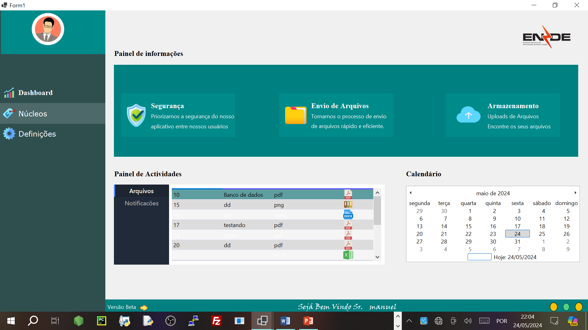

# 📂 Envio de Arquivos - ENDE-EP  

Este projeto foi desenvolvido durante meu estágio na área de **TI** na **ENDE-EP (Empresa Nacional de Distribuição e Comercialização de Eletricidade de Angola)**. O sistema foi criado para **gerenciamento, envio e digitalização de documentos**, incluindo suporte para **assistente virtual e gráficos interativos**, otimizando processos internos da empresa.  

## 🚀 Tecnologias Utilizadas  
- **C# (Windows Forms)** – Desenvolvimento da aplicação  
- **Guna UI** – Interface moderna e responsiva  
- **MySQL** – Banco de dados para armazenar documentos e registros  
- **Interop.WIA** – Integração com scanners e impressoras  
- **PdfiumViewer** – Manipulação e visualização de arquivos PDF  
- **System.Speech** – Assistente virtual com reconhecimento e síntese de voz  
- **LiveCharts** – Criação de gráficos interativos  

## 📸 Prévia do Projeto  
Aqui está uma imagem demonstrando a interface do sistema:  

  

## 🔧 Funcionalidades  
✔️ **Salvar Arquivos** – Armazena documentos no banco de dados MySQL  
✔️ **Envio de Arquivos entre Núcleos** – Compartilhamento eficiente dentro da organização  
✔️ **Digitalização de Documentos** – Conexão com scanners via **Interop.WIA**  
✔️ **Visualização de PDFs** – Uso do **PdfiumViewer** para abrir e manipular arquivos  
✔️ **Assistente Virtual** – Comandos de voz utilizando **System.Speech**  
✔️ **Gráficos Interativos** – Relatórios visuais com **LiveCharts**  
✔️ **Interface Moderna** – Criada com **Guna UI** para uma experiência mais fluida  

## ⚙️ Como Executar  
1. **Clone este repositório:**  
   ```sh
   git clone https://github.com/seu-usuario/envio-arquivos.git

